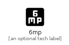

# _6Mp


```text
material-4/Image/_6Mp
```

```text
include('material-4/Image/_6Mp')
```


| Illustration | _6Mp |
| :---: | :---: |
|  |  |


## Sprites
The item provides the following sriptes:

- `<$_6MpXs>`
- `<$_6MpSm>`
- `<$_6MpMd>`
- `<$_6MpLg>`


## _6Mp

### Load remotely
```plantuml
@startuml
' configures the library
!global $LIB_BASE_LOCATION="https://raw.githubusercontent.com/tmorin/plantuml-libs/master/distribution"

' loads the library's bootstrap
!include $LIB_BASE_LOCATION/bootstrap.puml

' loads the package bootstrap
include('material-4/bootstrap')

' loads the Item which embeds the element _6Mp
include('material-4/Image/_6Mp')

' renders the element
_6Mp('6mp', '6mp', 'an optional tech label', 'an optional description')
@enduml
```

### Load locally
```plantuml
@startuml
' configures the library
!global $INCLUSION_MODE="local"
!global $LIB_BASE_LOCATION="../.."

' loads the library's bootstrap
!include $LIB_BASE_LOCATION/bootstrap.puml

' loads the package bootstrap
include('material-4/bootstrap')

' loads the Item which embeds the element _6Mp
include('material-4/Image/_6Mp')

' renders the element
_6Mp('6mp', '6mp', 'an optional tech label', 'an optional description')
@enduml
```

