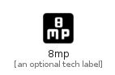

# _8Mp


```text
material-4/Image/_8Mp
```

```text
include('material-4/Image/_8Mp')
```


| Illustration | _8Mp |
| :---: | :---: |
|  |  |


## Sprites
The item provides the following sriptes:

- `<$_8MpXs>`
- `<$_8MpSm>`
- `<$_8MpMd>`
- `<$_8MpLg>`


## _8Mp

### Load remotely
```plantuml
@startuml
' configures the library
!global $LIB_BASE_LOCATION="https://raw.githubusercontent.com/tmorin/plantuml-libs/master/distribution"

' loads the library's bootstrap
!include $LIB_BASE_LOCATION/bootstrap.puml

' loads the package bootstrap
include('material-4/bootstrap')

' loads the Item which embeds the element _8Mp
include('material-4/Image/_8Mp')

' renders the element
_8Mp('8mp', '8mp', 'an optional tech label', 'an optional description')
@enduml
```

### Load locally
```plantuml
@startuml
' configures the library
!global $INCLUSION_MODE="local"
!global $LIB_BASE_LOCATION="../.."

' loads the library's bootstrap
!include $LIB_BASE_LOCATION/bootstrap.puml

' loads the package bootstrap
include('material-4/bootstrap')

' loads the Item which embeds the element _8Mp
include('material-4/Image/_8Mp')

' renders the element
_8Mp('8mp', '8mp', 'an optional tech label', 'an optional description')
@enduml
```

