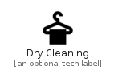

# DryCleaning


```text
material-4/Maps/DryCleaning
```

```text
include('material-4/Maps/DryCleaning')
```


| Illustration | DryCleaning |
| :---: | :---: |
|  |  |


## Sprites
The item provides the following sriptes:

- `<$DryCleaningXs>`
- `<$DryCleaningSm>`
- `<$DryCleaningMd>`
- `<$DryCleaningLg>`


## DryCleaning

### Load remotely
```plantuml
@startuml
' configures the library
!global $LIB_BASE_LOCATION="https://raw.githubusercontent.com/tmorin/plantuml-libs/master/distribution"

' loads the library's bootstrap
!include $LIB_BASE_LOCATION/bootstrap.puml

' loads the package bootstrap
include('material-4/bootstrap')

' loads the Item which embeds the element DryCleaning
include('material-4/Maps/DryCleaning')

' renders the element
DryCleaning('DryCleaning', 'Dry Cleaning', 'an optional tech label', 'an optional description')
@enduml
```

### Load locally
```plantuml
@startuml
' configures the library
!global $INCLUSION_MODE="local"
!global $LIB_BASE_LOCATION="../.."

' loads the library's bootstrap
!include $LIB_BASE_LOCATION/bootstrap.puml

' loads the package bootstrap
include('material-4/bootstrap')

' loads the Item which embeds the element DryCleaning
include('material-4/Maps/DryCleaning')

' renders the element
DryCleaning('DryCleaning', 'Dry Cleaning', 'an optional tech label', 'an optional description')
@enduml
```

