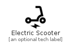

# ElectricScooter


```text
material-4/Maps/ElectricScooter
```

```text
include('material-4/Maps/ElectricScooter')
```


| Illustration | ElectricScooter |
| :---: | :---: |
|  |  |


## Sprites
The item provides the following sriptes:

- `<$ElectricScooterXs>`
- `<$ElectricScooterSm>`
- `<$ElectricScooterMd>`
- `<$ElectricScooterLg>`


## ElectricScooter

### Load remotely
```plantuml
@startuml
' configures the library
!global $LIB_BASE_LOCATION="https://raw.githubusercontent.com/tmorin/plantuml-libs/master/distribution"

' loads the library's bootstrap
!include $LIB_BASE_LOCATION/bootstrap.puml

' loads the package bootstrap
include('material-4/bootstrap')

' loads the Item which embeds the element ElectricScooter
include('material-4/Maps/ElectricScooter')

' renders the element
ElectricScooter('ElectricScooter', 'Electric Scooter', 'an optional tech label', 'an optional description')
@enduml
```

### Load locally
```plantuml
@startuml
' configures the library
!global $INCLUSION_MODE="local"
!global $LIB_BASE_LOCATION="../.."

' loads the library's bootstrap
!include $LIB_BASE_LOCATION/bootstrap.puml

' loads the package bootstrap
include('material-4/bootstrap')

' loads the Item which embeds the element ElectricScooter
include('material-4/Maps/ElectricScooter')

' renders the element
ElectricScooter('ElectricScooter', 'Electric Scooter', 'an optional tech label', 'an optional description')
@enduml
```

