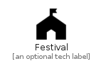

# Festival


```text
material-4/Maps/Festival
```

```text
include('material-4/Maps/Festival')
```


| Illustration | Festival |
| :---: | :---: |
|  |  |


## Sprites
The item provides the following sriptes:

- `<$FestivalXs>`
- `<$FestivalSm>`
- `<$FestivalMd>`
- `<$FestivalLg>`


## Festival

### Load remotely
```plantuml
@startuml
' configures the library
!global $LIB_BASE_LOCATION="https://raw.githubusercontent.com/tmorin/plantuml-libs/master/distribution"

' loads the library's bootstrap
!include $LIB_BASE_LOCATION/bootstrap.puml

' loads the package bootstrap
include('material-4/bootstrap')

' loads the Item which embeds the element Festival
include('material-4/Maps/Festival')

' renders the element
Festival('Festival', 'Festival', 'an optional tech label', 'an optional description')
@enduml
```

### Load locally
```plantuml
@startuml
' configures the library
!global $INCLUSION_MODE="local"
!global $LIB_BASE_LOCATION="../.."

' loads the library's bootstrap
!include $LIB_BASE_LOCATION/bootstrap.puml

' loads the package bootstrap
include('material-4/bootstrap')

' loads the Item which embeds the element Festival
include('material-4/Maps/Festival')

' renders the element
Festival('Festival', 'Festival', 'an optional tech label', 'an optional description')
@enduml
```

