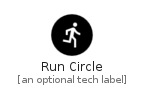

# RunCircle


```text
material-4/Maps/RunCircle
```

```text
include('material-4/Maps/RunCircle')
```


| Illustration | RunCircle |
| :---: | :---: |
|  |  |


## Sprites
The item provides the following sriptes:

- `<$RunCircleXs>`
- `<$RunCircleSm>`
- `<$RunCircleMd>`
- `<$RunCircleLg>`


## RunCircle

### Load remotely
```plantuml
@startuml
' configures the library
!global $LIB_BASE_LOCATION="https://raw.githubusercontent.com/tmorin/plantuml-libs/master/distribution"

' loads the library's bootstrap
!include $LIB_BASE_LOCATION/bootstrap.puml

' loads the package bootstrap
include('material-4/bootstrap')

' loads the Item which embeds the element RunCircle
include('material-4/Maps/RunCircle')

' renders the element
RunCircle('RunCircle', 'Run Circle', 'an optional tech label', 'an optional description')
@enduml
```

### Load locally
```plantuml
@startuml
' configures the library
!global $INCLUSION_MODE="local"
!global $LIB_BASE_LOCATION="../.."

' loads the library's bootstrap
!include $LIB_BASE_LOCATION/bootstrap.puml

' loads the package bootstrap
include('material-4/bootstrap')

' loads the Item which embeds the element RunCircle
include('material-4/Maps/RunCircle')

' renders the element
RunCircle('RunCircle', 'Run Circle', 'an optional tech label', 'an optional description')
@enduml
```

