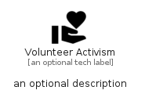

# VolunteerActivism


```text
material-4/Maps/VolunteerActivism
```

```text
include('material-4/Maps/VolunteerActivism')
```


| Illustration | VolunteerActivism |
| :---: | :---: |
|  |  |


## Sprites
The item provides the following sriptes:

- `<$VolunteerActivismXs>`
- `<$VolunteerActivismSm>`
- `<$VolunteerActivismMd>`
- `<$VolunteerActivismLg>`


## VolunteerActivism

### Load remotely
```plantuml
@startuml
' configures the library
!global $LIB_BASE_LOCATION="https://raw.githubusercontent.com/tmorin/plantuml-libs/master/distribution"

' loads the library's bootstrap
!include $LIB_BASE_LOCATION/bootstrap.puml

' loads the package bootstrap
include('material-4/bootstrap')

' loads the Item which embeds the element VolunteerActivism
include('material-4/Maps/VolunteerActivism')

' renders the element
VolunteerActivism('VolunteerActivism', 'Volunteer Activism', 'an optional tech label', 'an optional description')
@enduml
```

### Load locally
```plantuml
@startuml
' configures the library
!global $INCLUSION_MODE="local"
!global $LIB_BASE_LOCATION="../.."

' loads the library's bootstrap
!include $LIB_BASE_LOCATION/bootstrap.puml

' loads the package bootstrap
include('material-4/bootstrap')

' loads the Item which embeds the element VolunteerActivism
include('material-4/Maps/VolunteerActivism')

' renders the element
VolunteerActivism('VolunteerActivism', 'Volunteer Activism', 'an optional tech label', 'an optional description')
@enduml
```

