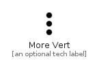

# MoreVert


```text
material-4/Navigation/MoreVert
```

```text
include('material-4/Navigation/MoreVert')
```


| Illustration | MoreVert |
| :---: | :---: |
|  |  |


## Sprites
The item provides the following sriptes:

- `<$MoreVertXs>`
- `<$MoreVertSm>`
- `<$MoreVertMd>`
- `<$MoreVertLg>`


## MoreVert

### Load remotely
```plantuml
@startuml
' configures the library
!global $LIB_BASE_LOCATION="https://raw.githubusercontent.com/tmorin/plantuml-libs/master/distribution"

' loads the library's bootstrap
!include $LIB_BASE_LOCATION/bootstrap.puml

' loads the package bootstrap
include('material-4/bootstrap')

' loads the Item which embeds the element MoreVert
include('material-4/Navigation/MoreVert')

' renders the element
MoreVert('MoreVert', 'More Vert', 'an optional tech label', 'an optional description')
@enduml
```

### Load locally
```plantuml
@startuml
' configures the library
!global $INCLUSION_MODE="local"
!global $LIB_BASE_LOCATION="../.."

' loads the library's bootstrap
!include $LIB_BASE_LOCATION/bootstrap.puml

' loads the package bootstrap
include('material-4/bootstrap')

' loads the Item which embeds the element MoreVert
include('material-4/Navigation/MoreVert')

' renders the element
MoreVert('MoreVert', 'More Vert', 'an optional tech label', 'an optional description')
@enduml
```

