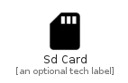

# SdCard


```text
material-4/Notification/SdCard
```

```text
include('material-4/Notification/SdCard')
```


| Illustration | SdCard |
| :---: | :---: |
|  |  |


## Sprites
The item provides the following sriptes:

- `<$SdCardXs>`
- `<$SdCardSm>`
- `<$SdCardMd>`
- `<$SdCardLg>`


## SdCard

### Load remotely
```plantuml
@startuml
' configures the library
!global $LIB_BASE_LOCATION="https://raw.githubusercontent.com/tmorin/plantuml-libs/master/distribution"

' loads the library's bootstrap
!include $LIB_BASE_LOCATION/bootstrap.puml

' loads the package bootstrap
include('material-4/bootstrap')

' loads the Item which embeds the element SdCard
include('material-4/Notification/SdCard')

' renders the element
SdCard('SdCard', 'Sd Card', 'an optional tech label', 'an optional description')
@enduml
```

### Load locally
```plantuml
@startuml
' configures the library
!global $INCLUSION_MODE="local"
!global $LIB_BASE_LOCATION="../.."

' loads the library's bootstrap
!include $LIB_BASE_LOCATION/bootstrap.puml

' loads the package bootstrap
include('material-4/bootstrap')

' loads the Item which embeds the element SdCard
include('material-4/Notification/SdCard')

' renders the element
SdCard('SdCard', 'Sd Card', 'an optional tech label', 'an optional description')
@enduml
```

