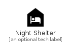

# NightShelter


```text
material-4/Places/NightShelter
```

```text
include('material-4/Places/NightShelter')
```


| Illustration | NightShelter |
| :---: | :---: |
|  |  |


## Sprites
The item provides the following sriptes:

- `<$NightShelterXs>`
- `<$NightShelterSm>`
- `<$NightShelterMd>`
- `<$NightShelterLg>`


## NightShelter

### Load remotely
```plantuml
@startuml
' configures the library
!global $LIB_BASE_LOCATION="https://raw.githubusercontent.com/tmorin/plantuml-libs/master/distribution"

' loads the library's bootstrap
!include $LIB_BASE_LOCATION/bootstrap.puml

' loads the package bootstrap
include('material-4/bootstrap')

' loads the Item which embeds the element NightShelter
include('material-4/Places/NightShelter')

' renders the element
NightShelter('NightShelter', 'Night Shelter', 'an optional tech label', 'an optional description')
@enduml
```

### Load locally
```plantuml
@startuml
' configures the library
!global $INCLUSION_MODE="local"
!global $LIB_BASE_LOCATION="../.."

' loads the library's bootstrap
!include $LIB_BASE_LOCATION/bootstrap.puml

' loads the package bootstrap
include('material-4/bootstrap')

' loads the Item which embeds the element NightShelter
include('material-4/Places/NightShelter')

' renders the element
NightShelter('NightShelter', 'Night Shelter', 'an optional tech label', 'an optional description')
@enduml
```

