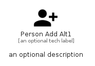

# PersonAddAlt1


```text
material-4/Social/PersonAddAlt1
```

```text
include('material-4/Social/PersonAddAlt1')
```


| Illustration | PersonAddAlt1 |
| :---: | :---: |
|  |  |


## Sprites
The item provides the following sriptes:

- `<$PersonAddAlt1Xs>`
- `<$PersonAddAlt1Sm>`
- `<$PersonAddAlt1Md>`
- `<$PersonAddAlt1Lg>`


## PersonAddAlt1

### Load remotely
```plantuml
@startuml
' configures the library
!global $LIB_BASE_LOCATION="https://raw.githubusercontent.com/tmorin/plantuml-libs/master/distribution"

' loads the library's bootstrap
!include $LIB_BASE_LOCATION/bootstrap.puml

' loads the package bootstrap
include('material-4/bootstrap')

' loads the Item which embeds the element PersonAddAlt1
include('material-4/Social/PersonAddAlt1')

' renders the element
PersonAddAlt1('PersonAddAlt1', 'Person Add Alt1', 'an optional tech label', 'an optional description')
@enduml
```

### Load locally
```plantuml
@startuml
' configures the library
!global $INCLUSION_MODE="local"
!global $LIB_BASE_LOCATION="../.."

' loads the library's bootstrap
!include $LIB_BASE_LOCATION/bootstrap.puml

' loads the package bootstrap
include('material-4/bootstrap')

' loads the Item which embeds the element PersonAddAlt1
include('material-4/Social/PersonAddAlt1')

' renders the element
PersonAddAlt1('PersonAddAlt1', 'Person Add Alt1', 'an optional tech label', 'an optional description')
@enduml
```

