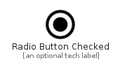

# RadioButtonChecked


```text
material-4/Toggle/RadioButtonChecked
```

```text
include('material-4/Toggle/RadioButtonChecked')
```


| Illustration | RadioButtonChecked |
| :---: | :---: |
|  |  |


## Sprites
The item provides the following sriptes:

- `<$RadioButtonCheckedXs>`
- `<$RadioButtonCheckedSm>`
- `<$RadioButtonCheckedMd>`
- `<$RadioButtonCheckedLg>`


## RadioButtonChecked

### Load remotely
```plantuml
@startuml
' configures the library
!global $LIB_BASE_LOCATION="https://raw.githubusercontent.com/tmorin/plantuml-libs/master/distribution"

' loads the library's bootstrap
!include $LIB_BASE_LOCATION/bootstrap.puml

' loads the package bootstrap
include('material-4/bootstrap')

' loads the Item which embeds the element RadioButtonChecked
include('material-4/Toggle/RadioButtonChecked')

' renders the element
RadioButtonChecked('RadioButtonChecked', 'Radio Button Checked', 'an optional tech label', 'an optional description')
@enduml
```

### Load locally
```plantuml
@startuml
' configures the library
!global $INCLUSION_MODE="local"
!global $LIB_BASE_LOCATION="../.."

' loads the library's bootstrap
!include $LIB_BASE_LOCATION/bootstrap.puml

' loads the package bootstrap
include('material-4/bootstrap')

' loads the Item which embeds the element RadioButtonChecked
include('material-4/Toggle/RadioButtonChecked')

' renders the element
RadioButtonChecked('RadioButtonChecked', 'Radio Button Checked', 'an optional tech label', 'an optional description')
@enduml
```

