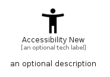

# AccessibilityNew


```text
material/Action/AccessibilityNew
```

```text
include('material/Action/AccessibilityNew')
```


| Illustration | AccessibilityNew |
| :---: | :---: |
|  |  |


## Sprites
The item provides the following sriptes:

- `<$AccessibilityNewXs>`
- `<$AccessibilityNewSm>`
- `<$AccessibilityNewMd>`
- `<$AccessibilityNewLg>`


## AccessibilityNew

### Load remotely
```plantuml
@startuml
' configures the library
!global $LIB_BASE_LOCATION="https://raw.githubusercontent.com/tmorin/plantuml-libs/master/distribution"

' loads the library's bootstrap
!include $LIB_BASE_LOCATION/bootstrap.puml

' loads the package bootstrap
include('material/bootstrap')

' loads the Item which embeds the element AccessibilityNew
include('material/Action/AccessibilityNew')

' renders the element
AccessibilityNew('AccessibilityNew', 'Accessibility New', 'an optional tech label', 'an optional description')
@enduml
```

### Load locally
```plantuml
@startuml
' configures the library
!global $INCLUSION_MODE="local"
!global $LIB_BASE_LOCATION="../.."

' loads the library's bootstrap
!include $LIB_BASE_LOCATION/bootstrap.puml

' loads the package bootstrap
include('material/bootstrap')

' loads the Item which embeds the element AccessibilityNew
include('material/Action/AccessibilityNew')

' renders the element
AccessibilityNew('AccessibilityNew', 'Accessibility New', 'an optional tech label', 'an optional description')
@enduml
```

