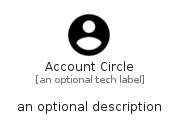

# AccountCircle


```text
material/Action/AccountCircle
```

```text
include('material/Action/AccountCircle')
```


| Illustration | AccountCircle |
| :---: | :---: |
|  |  |


## Sprites
The item provides the following sriptes:

- `<$AccountCircleXs>`
- `<$AccountCircleSm>`
- `<$AccountCircleMd>`
- `<$AccountCircleLg>`


## AccountCircle

### Load remotely
```plantuml
@startuml
' configures the library
!global $LIB_BASE_LOCATION="https://raw.githubusercontent.com/tmorin/plantuml-libs/master/distribution"

' loads the library's bootstrap
!include $LIB_BASE_LOCATION/bootstrap.puml

' loads the package bootstrap
include('material/bootstrap')

' loads the Item which embeds the element AccountCircle
include('material/Action/AccountCircle')

' renders the element
AccountCircle('AccountCircle', 'Account Circle', 'an optional tech label', 'an optional description')
@enduml
```

### Load locally
```plantuml
@startuml
' configures the library
!global $INCLUSION_MODE="local"
!global $LIB_BASE_LOCATION="../.."

' loads the library's bootstrap
!include $LIB_BASE_LOCATION/bootstrap.puml

' loads the package bootstrap
include('material/bootstrap')

' loads the Item which embeds the element AccountCircle
include('material/Action/AccountCircle')

' renders the element
AccountCircle('AccountCircle', 'Account Circle', 'an optional tech label', 'an optional description')
@enduml
```

