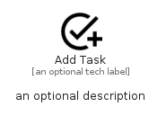

# AddTask


```text
material/Action/AddTask
```

```text
include('material/Action/AddTask')
```


| Illustration | AddTask |
| :---: | :---: |
|  |  |


## Sprites
The item provides the following sriptes:

- `<$AddTaskXs>`
- `<$AddTaskSm>`
- `<$AddTaskMd>`
- `<$AddTaskLg>`


## AddTask

### Load remotely
```plantuml
@startuml
' configures the library
!global $LIB_BASE_LOCATION="https://raw.githubusercontent.com/tmorin/plantuml-libs/master/distribution"

' loads the library's bootstrap
!include $LIB_BASE_LOCATION/bootstrap.puml

' loads the package bootstrap
include('material/bootstrap')

' loads the Item which embeds the element AddTask
include('material/Action/AddTask')

' renders the element
AddTask('AddTask', 'Add Task', 'an optional tech label', 'an optional description')
@enduml
```

### Load locally
```plantuml
@startuml
' configures the library
!global $INCLUSION_MODE="local"
!global $LIB_BASE_LOCATION="../.."

' loads the library's bootstrap
!include $LIB_BASE_LOCATION/bootstrap.puml

' loads the package bootstrap
include('material/bootstrap')

' loads the Item which embeds the element AddTask
include('material/Action/AddTask')

' renders the element
AddTask('AddTask', 'Add Task', 'an optional tech label', 'an optional description')
@enduml
```

