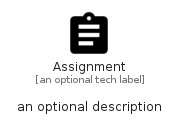

# Assignment


```text
material/Action/Assignment
```

```text
include('material/Action/Assignment')
```


| Illustration | Assignment |
| :---: | :---: |
|  |  |


## Sprites
The item provides the following sriptes:

- `<$AssignmentXs>`
- `<$AssignmentSm>`
- `<$AssignmentMd>`
- `<$AssignmentLg>`


## Assignment

### Load remotely
```plantuml
@startuml
' configures the library
!global $LIB_BASE_LOCATION="https://raw.githubusercontent.com/tmorin/plantuml-libs/master/distribution"

' loads the library's bootstrap
!include $LIB_BASE_LOCATION/bootstrap.puml

' loads the package bootstrap
include('material/bootstrap')

' loads the Item which embeds the element Assignment
include('material/Action/Assignment')

' renders the element
Assignment('Assignment', 'Assignment', 'an optional tech label', 'an optional description')
@enduml
```

### Load locally
```plantuml
@startuml
' configures the library
!global $INCLUSION_MODE="local"
!global $LIB_BASE_LOCATION="../.."

' loads the library's bootstrap
!include $LIB_BASE_LOCATION/bootstrap.puml

' loads the package bootstrap
include('material/bootstrap')

' loads the Item which embeds the element Assignment
include('material/Action/Assignment')

' renders the element
Assignment('Assignment', 'Assignment', 'an optional tech label', 'an optional description')
@enduml
```

