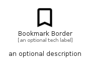

# BookmarkBorder


```text
material/Action/BookmarkBorder
```

```text
include('material/Action/BookmarkBorder')
```


| Illustration | BookmarkBorder |
| :---: | :---: |
|  |  |


## Sprites
The item provides the following sriptes:

- `<$BookmarkBorderXs>`
- `<$BookmarkBorderSm>`
- `<$BookmarkBorderMd>`
- `<$BookmarkBorderLg>`


## BookmarkBorder

### Load remotely
```plantuml
@startuml
' configures the library
!global $LIB_BASE_LOCATION="https://raw.githubusercontent.com/tmorin/plantuml-libs/master/distribution"

' loads the library's bootstrap
!include $LIB_BASE_LOCATION/bootstrap.puml

' loads the package bootstrap
include('material/bootstrap')

' loads the Item which embeds the element BookmarkBorder
include('material/Action/BookmarkBorder')

' renders the element
BookmarkBorder('BookmarkBorder', 'Bookmark Border', 'an optional tech label', 'an optional description')
@enduml
```

### Load locally
```plantuml
@startuml
' configures the library
!global $INCLUSION_MODE="local"
!global $LIB_BASE_LOCATION="../.."

' loads the library's bootstrap
!include $LIB_BASE_LOCATION/bootstrap.puml

' loads the package bootstrap
include('material/bootstrap')

' loads the Item which embeds the element BookmarkBorder
include('material/Action/BookmarkBorder')

' renders the element
BookmarkBorder('BookmarkBorder', 'Bookmark Border', 'an optional tech label', 'an optional description')
@enduml
```

