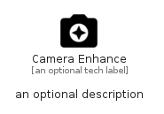

# CameraEnhance


```text
material/Action/CameraEnhance
```

```text
include('material/Action/CameraEnhance')
```


| Illustration | CameraEnhance |
| :---: | :---: |
|  |  |


## Sprites
The item provides the following sriptes:

- `<$CameraEnhanceXs>`
- `<$CameraEnhanceSm>`
- `<$CameraEnhanceMd>`
- `<$CameraEnhanceLg>`


## CameraEnhance

### Load remotely
```plantuml
@startuml
' configures the library
!global $LIB_BASE_LOCATION="https://raw.githubusercontent.com/tmorin/plantuml-libs/master/distribution"

' loads the library's bootstrap
!include $LIB_BASE_LOCATION/bootstrap.puml

' loads the package bootstrap
include('material/bootstrap')

' loads the Item which embeds the element CameraEnhance
include('material/Action/CameraEnhance')

' renders the element
CameraEnhance('CameraEnhance', 'Camera Enhance', 'an optional tech label', 'an optional description')
@enduml
```

### Load locally
```plantuml
@startuml
' configures the library
!global $INCLUSION_MODE="local"
!global $LIB_BASE_LOCATION="../.."

' loads the library's bootstrap
!include $LIB_BASE_LOCATION/bootstrap.puml

' loads the package bootstrap
include('material/bootstrap')

' loads the Item which embeds the element CameraEnhance
include('material/Action/CameraEnhance')

' renders the element
CameraEnhance('CameraEnhance', 'Camera Enhance', 'an optional tech label', 'an optional description')
@enduml
```

