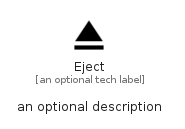

# Eject


```text
material/Action/Eject
```

```text
include('material/Action/Eject')
```


| Illustration | Eject |
| :---: | :---: |
|  |  |


## Sprites
The item provides the following sriptes:

- `<$EjectXs>`
- `<$EjectSm>`
- `<$EjectMd>`
- `<$EjectLg>`


## Eject

### Load remotely
```plantuml
@startuml
' configures the library
!global $LIB_BASE_LOCATION="https://raw.githubusercontent.com/tmorin/plantuml-libs/master/distribution"

' loads the library's bootstrap
!include $LIB_BASE_LOCATION/bootstrap.puml

' loads the package bootstrap
include('material/bootstrap')

' loads the Item which embeds the element Eject
include('material/Action/Eject')

' renders the element
Eject('Eject', 'Eject', 'an optional tech label', 'an optional description')
@enduml
```

### Load locally
```plantuml
@startuml
' configures the library
!global $INCLUSION_MODE="local"
!global $LIB_BASE_LOCATION="../.."

' loads the library's bootstrap
!include $LIB_BASE_LOCATION/bootstrap.puml

' loads the package bootstrap
include('material/bootstrap')

' loads the Item which embeds the element Eject
include('material/Action/Eject')

' renders the element
Eject('Eject', 'Eject', 'an optional tech label', 'an optional description')
@enduml
```

