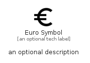

# EuroSymbol


```text
material/Action/EuroSymbol
```

```text
include('material/Action/EuroSymbol')
```


| Illustration | EuroSymbol |
| :---: | :---: |
|  |  |


## Sprites
The item provides the following sriptes:

- `<$EuroSymbolXs>`
- `<$EuroSymbolSm>`
- `<$EuroSymbolMd>`
- `<$EuroSymbolLg>`


## EuroSymbol

### Load remotely
```plantuml
@startuml
' configures the library
!global $LIB_BASE_LOCATION="https://raw.githubusercontent.com/tmorin/plantuml-libs/master/distribution"

' loads the library's bootstrap
!include $LIB_BASE_LOCATION/bootstrap.puml

' loads the package bootstrap
include('material/bootstrap')

' loads the Item which embeds the element EuroSymbol
include('material/Action/EuroSymbol')

' renders the element
EuroSymbol('EuroSymbol', 'Euro Symbol', 'an optional tech label', 'an optional description')
@enduml
```

### Load locally
```plantuml
@startuml
' configures the library
!global $INCLUSION_MODE="local"
!global $LIB_BASE_LOCATION="../.."

' loads the library's bootstrap
!include $LIB_BASE_LOCATION/bootstrap.puml

' loads the package bootstrap
include('material/bootstrap')

' loads the Item which embeds the element EuroSymbol
include('material/Action/EuroSymbol')

' renders the element
EuroSymbol('EuroSymbol', 'Euro Symbol', 'an optional tech label', 'an optional description')
@enduml
```

