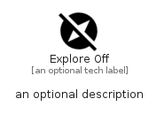

# ExploreOff


```text
material/Action/ExploreOff
```

```text
include('material/Action/ExploreOff')
```


| Illustration | ExploreOff |
| :---: | :---: |
|  |  |


## Sprites
The item provides the following sriptes:

- `<$ExploreOffXs>`
- `<$ExploreOffSm>`
- `<$ExploreOffMd>`
- `<$ExploreOffLg>`


## ExploreOff

### Load remotely
```plantuml
@startuml
' configures the library
!global $LIB_BASE_LOCATION="https://raw.githubusercontent.com/tmorin/plantuml-libs/master/distribution"

' loads the library's bootstrap
!include $LIB_BASE_LOCATION/bootstrap.puml

' loads the package bootstrap
include('material/bootstrap')

' loads the Item which embeds the element ExploreOff
include('material/Action/ExploreOff')

' renders the element
ExploreOff('ExploreOff', 'Explore Off', 'an optional tech label', 'an optional description')
@enduml
```

### Load locally
```plantuml
@startuml
' configures the library
!global $INCLUSION_MODE="local"
!global $LIB_BASE_LOCATION="../.."

' loads the library's bootstrap
!include $LIB_BASE_LOCATION/bootstrap.puml

' loads the package bootstrap
include('material/bootstrap')

' loads the Item which embeds the element ExploreOff
include('material/Action/ExploreOff')

' renders the element
ExploreOff('ExploreOff', 'Explore Off', 'an optional tech label', 'an optional description')
@enduml
```

