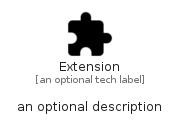

# Extension


```text
material/Action/Extension
```

```text
include('material/Action/Extension')
```


| Illustration | Extension |
| :---: | :---: |
|  |  |


## Sprites
The item provides the following sriptes:

- `<$ExtensionXs>`
- `<$ExtensionSm>`
- `<$ExtensionMd>`
- `<$ExtensionLg>`


## Extension

### Load remotely
```plantuml
@startuml
' configures the library
!global $LIB_BASE_LOCATION="https://raw.githubusercontent.com/tmorin/plantuml-libs/master/distribution"

' loads the library's bootstrap
!include $LIB_BASE_LOCATION/bootstrap.puml

' loads the package bootstrap
include('material/bootstrap')

' loads the Item which embeds the element Extension
include('material/Action/Extension')

' renders the element
Extension('Extension', 'Extension', 'an optional tech label', 'an optional description')
@enduml
```

### Load locally
```plantuml
@startuml
' configures the library
!global $INCLUSION_MODE="local"
!global $LIB_BASE_LOCATION="../.."

' loads the library's bootstrap
!include $LIB_BASE_LOCATION/bootstrap.puml

' loads the package bootstrap
include('material/bootstrap')

' loads the Item which embeds the element Extension
include('material/Action/Extension')

' renders the element
Extension('Extension', 'Extension', 'an optional tech label', 'an optional description')
@enduml
```

