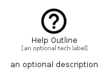

# HelpOutline


```text
material/Action/HelpOutline
```

```text
include('material/Action/HelpOutline')
```


| Illustration | HelpOutline |
| :---: | :---: |
|  |  |


## Sprites
The item provides the following sriptes:

- `<$HelpOutlineXs>`
- `<$HelpOutlineSm>`
- `<$HelpOutlineMd>`
- `<$HelpOutlineLg>`


## HelpOutline

### Load remotely
```plantuml
@startuml
' configures the library
!global $LIB_BASE_LOCATION="https://raw.githubusercontent.com/tmorin/plantuml-libs/master/distribution"

' loads the library's bootstrap
!include $LIB_BASE_LOCATION/bootstrap.puml

' loads the package bootstrap
include('material/bootstrap')

' loads the Item which embeds the element HelpOutline
include('material/Action/HelpOutline')

' renders the element
HelpOutline('HelpOutline', 'Help Outline', 'an optional tech label', 'an optional description')
@enduml
```

### Load locally
```plantuml
@startuml
' configures the library
!global $INCLUSION_MODE="local"
!global $LIB_BASE_LOCATION="../.."

' loads the library's bootstrap
!include $LIB_BASE_LOCATION/bootstrap.puml

' loads the package bootstrap
include('material/bootstrap')

' loads the Item which embeds the element HelpOutline
include('material/Action/HelpOutline')

' renders the element
HelpOutline('HelpOutline', 'Help Outline', 'an optional tech label', 'an optional description')
@enduml
```

