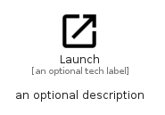

# Launch


```text
material/Action/Launch
```

```text
include('material/Action/Launch')
```


| Illustration | Launch |
| :---: | :---: |
|  |  |


## Sprites
The item provides the following sriptes:

- `<$LaunchXs>`
- `<$LaunchSm>`
- `<$LaunchMd>`
- `<$LaunchLg>`


## Launch

### Load remotely
```plantuml
@startuml
' configures the library
!global $LIB_BASE_LOCATION="https://raw.githubusercontent.com/tmorin/plantuml-libs/master/distribution"

' loads the library's bootstrap
!include $LIB_BASE_LOCATION/bootstrap.puml

' loads the package bootstrap
include('material/bootstrap')

' loads the Item which embeds the element Launch
include('material/Action/Launch')

' renders the element
Launch('Launch', 'Launch', 'an optional tech label', 'an optional description')
@enduml
```

### Load locally
```plantuml
@startuml
' configures the library
!global $INCLUSION_MODE="local"
!global $LIB_BASE_LOCATION="../.."

' loads the library's bootstrap
!include $LIB_BASE_LOCATION/bootstrap.puml

' loads the package bootstrap
include('material/bootstrap')

' loads the Item which embeds the element Launch
include('material/Action/Launch')

' renders the element
Launch('Launch', 'Launch', 'an optional tech label', 'an optional description')
@enduml
```

