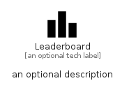

# Leaderboard


```text
material/Action/Leaderboard
```

```text
include('material/Action/Leaderboard')
```


| Illustration | Leaderboard |
| :---: | :---: |
|  |  |


## Sprites
The item provides the following sriptes:

- `<$LeaderboardXs>`
- `<$LeaderboardSm>`
- `<$LeaderboardMd>`
- `<$LeaderboardLg>`


## Leaderboard

### Load remotely
```plantuml
@startuml
' configures the library
!global $LIB_BASE_LOCATION="https://raw.githubusercontent.com/tmorin/plantuml-libs/master/distribution"

' loads the library's bootstrap
!include $LIB_BASE_LOCATION/bootstrap.puml

' loads the package bootstrap
include('material/bootstrap')

' loads the Item which embeds the element Leaderboard
include('material/Action/Leaderboard')

' renders the element
Leaderboard('Leaderboard', 'Leaderboard', 'an optional tech label', 'an optional description')
@enduml
```

### Load locally
```plantuml
@startuml
' configures the library
!global $INCLUSION_MODE="local"
!global $LIB_BASE_LOCATION="../.."

' loads the library's bootstrap
!include $LIB_BASE_LOCATION/bootstrap.puml

' loads the package bootstrap
include('material/bootstrap')

' loads the Item which embeds the element Leaderboard
include('material/Action/Leaderboard')

' renders the element
Leaderboard('Leaderboard', 'Leaderboard', 'an optional tech label', 'an optional description')
@enduml
```

