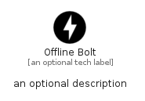

# OfflineBolt


```text
material/Action/OfflineBolt
```

```text
include('material/Action/OfflineBolt')
```


| Illustration | OfflineBolt |
| :---: | :---: |
|  |  |


## Sprites
The item provides the following sriptes:

- `<$OfflineBoltXs>`
- `<$OfflineBoltSm>`
- `<$OfflineBoltMd>`
- `<$OfflineBoltLg>`


## OfflineBolt

### Load remotely
```plantuml
@startuml
' configures the library
!global $LIB_BASE_LOCATION="https://raw.githubusercontent.com/tmorin/plantuml-libs/master/distribution"

' loads the library's bootstrap
!include $LIB_BASE_LOCATION/bootstrap.puml

' loads the package bootstrap
include('material/bootstrap')

' loads the Item which embeds the element OfflineBolt
include('material/Action/OfflineBolt')

' renders the element
OfflineBolt('OfflineBolt', 'Offline Bolt', 'an optional tech label', 'an optional description')
@enduml
```

### Load locally
```plantuml
@startuml
' configures the library
!global $INCLUSION_MODE="local"
!global $LIB_BASE_LOCATION="../.."

' loads the library's bootstrap
!include $LIB_BASE_LOCATION/bootstrap.puml

' loads the package bootstrap
include('material/bootstrap')

' loads the Item which embeds the element OfflineBolt
include('material/Action/OfflineBolt')

' renders the element
OfflineBolt('OfflineBolt', 'Offline Bolt', 'an optional tech label', 'an optional description')
@enduml
```

