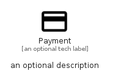

# Payment


```text
material/Action/Payment
```

```text
include('material/Action/Payment')
```


| Illustration | Payment |
| :---: | :---: |
|  |  |


## Sprites
The item provides the following sriptes:

- `<$PaymentXs>`
- `<$PaymentSm>`
- `<$PaymentMd>`
- `<$PaymentLg>`


## Payment

### Load remotely
```plantuml
@startuml
' configures the library
!global $LIB_BASE_LOCATION="https://raw.githubusercontent.com/tmorin/plantuml-libs/master/distribution"

' loads the library's bootstrap
!include $LIB_BASE_LOCATION/bootstrap.puml

' loads the package bootstrap
include('material/bootstrap')

' loads the Item which embeds the element Payment
include('material/Action/Payment')

' renders the element
Payment('Payment', 'Payment', 'an optional tech label', 'an optional description')
@enduml
```

### Load locally
```plantuml
@startuml
' configures the library
!global $INCLUSION_MODE="local"
!global $LIB_BASE_LOCATION="../.."

' loads the library's bootstrap
!include $LIB_BASE_LOCATION/bootstrap.puml

' loads the package bootstrap
include('material/bootstrap')

' loads the Item which embeds the element Payment
include('material/Action/Payment')

' renders the element
Payment('Payment', 'Payment', 'an optional tech label', 'an optional description')
@enduml
```

