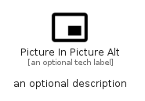

# PictureInPictureAlt


```text
material/Action/PictureInPictureAlt
```

```text
include('material/Action/PictureInPictureAlt')
```


| Illustration | PictureInPictureAlt |
| :---: | :---: |
|  |  |


## Sprites
The item provides the following sriptes:

- `<$PictureInPictureAltXs>`
- `<$PictureInPictureAltSm>`
- `<$PictureInPictureAltMd>`
- `<$PictureInPictureAltLg>`


## PictureInPictureAlt

### Load remotely
```plantuml
@startuml
' configures the library
!global $LIB_BASE_LOCATION="https://raw.githubusercontent.com/tmorin/plantuml-libs/master/distribution"

' loads the library's bootstrap
!include $LIB_BASE_LOCATION/bootstrap.puml

' loads the package bootstrap
include('material/bootstrap')

' loads the Item which embeds the element PictureInPictureAlt
include('material/Action/PictureInPictureAlt')

' renders the element
PictureInPictureAlt('PictureInPictureAlt', 'Picture In Picture Alt', 'an optional tech label', 'an optional description')
@enduml
```

### Load locally
```plantuml
@startuml
' configures the library
!global $INCLUSION_MODE="local"
!global $LIB_BASE_LOCATION="../.."

' loads the library's bootstrap
!include $LIB_BASE_LOCATION/bootstrap.puml

' loads the package bootstrap
include('material/bootstrap')

' loads the Item which embeds the element PictureInPictureAlt
include('material/Action/PictureInPictureAlt')

' renders the element
PictureInPictureAlt('PictureInPictureAlt', 'Picture In Picture Alt', 'an optional tech label', 'an optional description')
@enduml
```

