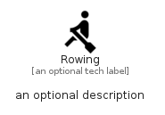

# Rowing


```text
material/Action/Rowing
```

```text
include('material/Action/Rowing')
```


| Illustration | Rowing |
| :---: | :---: |
|  |  |


## Sprites
The item provides the following sriptes:

- `<$RowingXs>`
- `<$RowingSm>`
- `<$RowingMd>`
- `<$RowingLg>`


## Rowing

### Load remotely
```plantuml
@startuml
' configures the library
!global $LIB_BASE_LOCATION="https://raw.githubusercontent.com/tmorin/plantuml-libs/master/distribution"

' loads the library's bootstrap
!include $LIB_BASE_LOCATION/bootstrap.puml

' loads the package bootstrap
include('material/bootstrap')

' loads the Item which embeds the element Rowing
include('material/Action/Rowing')

' renders the element
Rowing('Rowing', 'Rowing', 'an optional tech label', 'an optional description')
@enduml
```

### Load locally
```plantuml
@startuml
' configures the library
!global $INCLUSION_MODE="local"
!global $LIB_BASE_LOCATION="../.."

' loads the library's bootstrap
!include $LIB_BASE_LOCATION/bootstrap.puml

' loads the package bootstrap
include('material/bootstrap')

' loads the Item which embeds the element Rowing
include('material/Action/Rowing')

' renders the element
Rowing('Rowing', 'Rowing', 'an optional tech label', 'an optional description')
@enduml
```

