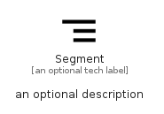

# Segment


```text
material/Action/Segment
```

```text
include('material/Action/Segment')
```


| Illustration | Segment |
| :---: | :---: |
|  |  |


## Sprites
The item provides the following sriptes:

- `<$SegmentXs>`
- `<$SegmentSm>`
- `<$SegmentMd>`
- `<$SegmentLg>`


## Segment

### Load remotely
```plantuml
@startuml
' configures the library
!global $LIB_BASE_LOCATION="https://raw.githubusercontent.com/tmorin/plantuml-libs/master/distribution"

' loads the library's bootstrap
!include $LIB_BASE_LOCATION/bootstrap.puml

' loads the package bootstrap
include('material/bootstrap')

' loads the Item which embeds the element Segment
include('material/Action/Segment')

' renders the element
Segment('Segment', 'Segment', 'an optional tech label', 'an optional description')
@enduml
```

### Load locally
```plantuml
@startuml
' configures the library
!global $INCLUSION_MODE="local"
!global $LIB_BASE_LOCATION="../.."

' loads the library's bootstrap
!include $LIB_BASE_LOCATION/bootstrap.puml

' loads the package bootstrap
include('material/bootstrap')

' loads the Item which embeds the element Segment
include('material/Action/Segment')

' renders the element
Segment('Segment', 'Segment', 'an optional tech label', 'an optional description')
@enduml
```

