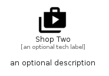

# ShopTwo


```text
material/Action/ShopTwo
```

```text
include('material/Action/ShopTwo')
```


| Illustration | ShopTwo |
| :---: | :---: |
|  |  |


## Sprites
The item provides the following sriptes:

- `<$ShopTwoXs>`
- `<$ShopTwoSm>`
- `<$ShopTwoMd>`
- `<$ShopTwoLg>`


## ShopTwo

### Load remotely
```plantuml
@startuml
' configures the library
!global $LIB_BASE_LOCATION="https://raw.githubusercontent.com/tmorin/plantuml-libs/master/distribution"

' loads the library's bootstrap
!include $LIB_BASE_LOCATION/bootstrap.puml

' loads the package bootstrap
include('material/bootstrap')

' loads the Item which embeds the element ShopTwo
include('material/Action/ShopTwo')

' renders the element
ShopTwo('ShopTwo', 'Shop Two', 'an optional tech label', 'an optional description')
@enduml
```

### Load locally
```plantuml
@startuml
' configures the library
!global $INCLUSION_MODE="local"
!global $LIB_BASE_LOCATION="../.."

' loads the library's bootstrap
!include $LIB_BASE_LOCATION/bootstrap.puml

' loads the package bootstrap
include('material/bootstrap')

' loads the Item which embeds the element ShopTwo
include('material/Action/ShopTwo')

' renders the element
ShopTwo('ShopTwo', 'Shop Two', 'an optional tech label', 'an optional description')
@enduml
```

