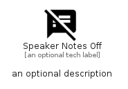

# SpeakerNotesOff


```text
material/Action/SpeakerNotesOff
```

```text
include('material/Action/SpeakerNotesOff')
```


| Illustration | SpeakerNotesOff |
| :---: | :---: |
|  |  |


## Sprites
The item provides the following sriptes:

- `<$SpeakerNotesOffXs>`
- `<$SpeakerNotesOffSm>`
- `<$SpeakerNotesOffMd>`
- `<$SpeakerNotesOffLg>`


## SpeakerNotesOff

### Load remotely
```plantuml
@startuml
' configures the library
!global $LIB_BASE_LOCATION="https://raw.githubusercontent.com/tmorin/plantuml-libs/master/distribution"

' loads the library's bootstrap
!include $LIB_BASE_LOCATION/bootstrap.puml

' loads the package bootstrap
include('material/bootstrap')

' loads the Item which embeds the element SpeakerNotesOff
include('material/Action/SpeakerNotesOff')

' renders the element
SpeakerNotesOff('SpeakerNotesOff', 'Speaker Notes Off', 'an optional tech label', 'an optional description')
@enduml
```

### Load locally
```plantuml
@startuml
' configures the library
!global $INCLUSION_MODE="local"
!global $LIB_BASE_LOCATION="../.."

' loads the library's bootstrap
!include $LIB_BASE_LOCATION/bootstrap.puml

' loads the package bootstrap
include('material/bootstrap')

' loads the Item which embeds the element SpeakerNotesOff
include('material/Action/SpeakerNotesOff')

' renders the element
SpeakerNotesOff('SpeakerNotesOff', 'Speaker Notes Off', 'an optional tech label', 'an optional description')
@enduml
```

