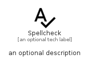

# Spellcheck


```text
material/Action/Spellcheck
```

```text
include('material/Action/Spellcheck')
```


| Illustration | Spellcheck |
| :---: | :---: |
|  |  |


## Sprites
The item provides the following sriptes:

- `<$SpellcheckXs>`
- `<$SpellcheckSm>`
- `<$SpellcheckMd>`
- `<$SpellcheckLg>`


## Spellcheck

### Load remotely
```plantuml
@startuml
' configures the library
!global $LIB_BASE_LOCATION="https://raw.githubusercontent.com/tmorin/plantuml-libs/master/distribution"

' loads the library's bootstrap
!include $LIB_BASE_LOCATION/bootstrap.puml

' loads the package bootstrap
include('material/bootstrap')

' loads the Item which embeds the element Spellcheck
include('material/Action/Spellcheck')

' renders the element
Spellcheck('Spellcheck', 'Spellcheck', 'an optional tech label', 'an optional description')
@enduml
```

### Load locally
```plantuml
@startuml
' configures the library
!global $INCLUSION_MODE="local"
!global $LIB_BASE_LOCATION="../.."

' loads the library's bootstrap
!include $LIB_BASE_LOCATION/bootstrap.puml

' loads the package bootstrap
include('material/bootstrap')

' loads the Item which embeds the element Spellcheck
include('material/Action/Spellcheck')

' renders the element
Spellcheck('Spellcheck', 'Spellcheck', 'an optional tech label', 'an optional description')
@enduml
```

