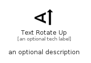

# TextRotateUp


```text
material/Action/TextRotateUp
```

```text
include('material/Action/TextRotateUp')
```


| Illustration | TextRotateUp |
| :---: | :---: |
|  |  |


## Sprites
The item provides the following sriptes:

- `<$TextRotateUpXs>`
- `<$TextRotateUpSm>`
- `<$TextRotateUpMd>`
- `<$TextRotateUpLg>`


## TextRotateUp

### Load remotely
```plantuml
@startuml
' configures the library
!global $LIB_BASE_LOCATION="https://raw.githubusercontent.com/tmorin/plantuml-libs/master/distribution"

' loads the library's bootstrap
!include $LIB_BASE_LOCATION/bootstrap.puml

' loads the package bootstrap
include('material/bootstrap')

' loads the Item which embeds the element TextRotateUp
include('material/Action/TextRotateUp')

' renders the element
TextRotateUp('TextRotateUp', 'Text Rotate Up', 'an optional tech label', 'an optional description')
@enduml
```

### Load locally
```plantuml
@startuml
' configures the library
!global $INCLUSION_MODE="local"
!global $LIB_BASE_LOCATION="../.."

' loads the library's bootstrap
!include $LIB_BASE_LOCATION/bootstrap.puml

' loads the package bootstrap
include('material/bootstrap')

' loads the Item which embeds the element TextRotateUp
include('material/Action/TextRotateUp')

' renders the element
TextRotateUp('TextRotateUp', 'Text Rotate Up', 'an optional tech label', 'an optional description')
@enduml
```

