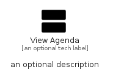

# ViewAgenda


```text
material/Action/ViewAgenda
```

```text
include('material/Action/ViewAgenda')
```


| Illustration | ViewAgenda |
| :---: | :---: |
|  |  |


## Sprites
The item provides the following sriptes:

- `<$ViewAgendaXs>`
- `<$ViewAgendaSm>`
- `<$ViewAgendaMd>`
- `<$ViewAgendaLg>`


## ViewAgenda

### Load remotely
```plantuml
@startuml
' configures the library
!global $LIB_BASE_LOCATION="https://raw.githubusercontent.com/tmorin/plantuml-libs/master/distribution"

' loads the library's bootstrap
!include $LIB_BASE_LOCATION/bootstrap.puml

' loads the package bootstrap
include('material/bootstrap')

' loads the Item which embeds the element ViewAgenda
include('material/Action/ViewAgenda')

' renders the element
ViewAgenda('ViewAgenda', 'View Agenda', 'an optional tech label', 'an optional description')
@enduml
```

### Load locally
```plantuml
@startuml
' configures the library
!global $INCLUSION_MODE="local"
!global $LIB_BASE_LOCATION="../.."

' loads the library's bootstrap
!include $LIB_BASE_LOCATION/bootstrap.puml

' loads the package bootstrap
include('material/bootstrap')

' loads the Item which embeds the element ViewAgenda
include('material/Action/ViewAgenda')

' renders the element
ViewAgenda('ViewAgenda', 'View Agenda', 'an optional tech label', 'an optional description')
@enduml
```

