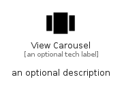

# ViewCarousel


```text
material/Action/ViewCarousel
```

```text
include('material/Action/ViewCarousel')
```


| Illustration | ViewCarousel |
| :---: | :---: |
|  |  |


## Sprites
The item provides the following sriptes:

- `<$ViewCarouselXs>`
- `<$ViewCarouselSm>`
- `<$ViewCarouselMd>`
- `<$ViewCarouselLg>`


## ViewCarousel

### Load remotely
```plantuml
@startuml
' configures the library
!global $LIB_BASE_LOCATION="https://raw.githubusercontent.com/tmorin/plantuml-libs/master/distribution"

' loads the library's bootstrap
!include $LIB_BASE_LOCATION/bootstrap.puml

' loads the package bootstrap
include('material/bootstrap')

' loads the Item which embeds the element ViewCarousel
include('material/Action/ViewCarousel')

' renders the element
ViewCarousel('ViewCarousel', 'View Carousel', 'an optional tech label', 'an optional description')
@enduml
```

### Load locally
```plantuml
@startuml
' configures the library
!global $INCLUSION_MODE="local"
!global $LIB_BASE_LOCATION="../.."

' loads the library's bootstrap
!include $LIB_BASE_LOCATION/bootstrap.puml

' loads the package bootstrap
include('material/bootstrap')

' loads the Item which embeds the element ViewCarousel
include('material/Action/ViewCarousel')

' renders the element
ViewCarousel('ViewCarousel', 'View Carousel', 'an optional tech label', 'an optional description')
@enduml
```

