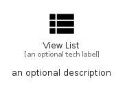

# ViewList


```text
material/Action/ViewList
```

```text
include('material/Action/ViewList')
```


| Illustration | ViewList |
| :---: | :---: |
|  |  |


## Sprites
The item provides the following sriptes:

- `<$ViewListXs>`
- `<$ViewListSm>`
- `<$ViewListMd>`
- `<$ViewListLg>`


## ViewList

### Load remotely
```plantuml
@startuml
' configures the library
!global $LIB_BASE_LOCATION="https://raw.githubusercontent.com/tmorin/plantuml-libs/master/distribution"

' loads the library's bootstrap
!include $LIB_BASE_LOCATION/bootstrap.puml

' loads the package bootstrap
include('material/bootstrap')

' loads the Item which embeds the element ViewList
include('material/Action/ViewList')

' renders the element
ViewList('ViewList', 'View List', 'an optional tech label', 'an optional description')
@enduml
```

### Load locally
```plantuml
@startuml
' configures the library
!global $INCLUSION_MODE="local"
!global $LIB_BASE_LOCATION="../.."

' loads the library's bootstrap
!include $LIB_BASE_LOCATION/bootstrap.puml

' loads the package bootstrap
include('material/bootstrap')

' loads the Item which embeds the element ViewList
include('material/Action/ViewList')

' renders the element
ViewList('ViewList', 'View List', 'an optional tech label', 'an optional description')
@enduml
```

