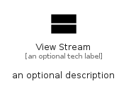

# ViewStream


```text
material/Action/ViewStream
```

```text
include('material/Action/ViewStream')
```


| Illustration | ViewStream |
| :---: | :---: |
|  |  |


## Sprites
The item provides the following sriptes:

- `<$ViewStreamXs>`
- `<$ViewStreamSm>`
- `<$ViewStreamMd>`
- `<$ViewStreamLg>`


## ViewStream

### Load remotely
```plantuml
@startuml
' configures the library
!global $LIB_BASE_LOCATION="https://raw.githubusercontent.com/tmorin/plantuml-libs/master/distribution"

' loads the library's bootstrap
!include $LIB_BASE_LOCATION/bootstrap.puml

' loads the package bootstrap
include('material/bootstrap')

' loads the Item which embeds the element ViewStream
include('material/Action/ViewStream')

' renders the element
ViewStream('ViewStream', 'View Stream', 'an optional tech label', 'an optional description')
@enduml
```

### Load locally
```plantuml
@startuml
' configures the library
!global $INCLUSION_MODE="local"
!global $LIB_BASE_LOCATION="../.."

' loads the library's bootstrap
!include $LIB_BASE_LOCATION/bootstrap.puml

' loads the package bootstrap
include('material/bootstrap')

' loads the Item which embeds the element ViewStream
include('material/Action/ViewStream')

' renders the element
ViewStream('ViewStream', 'View Stream', 'an optional tech label', 'an optional description')
@enduml
```

