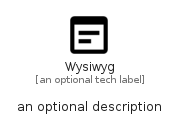

# Wysiwyg


```text
material/Action/Wysiwyg
```

```text
include('material/Action/Wysiwyg')
```


| Illustration | Wysiwyg |
| :---: | :---: |
|  |  |


## Sprites
The item provides the following sriptes:

- `<$WysiwygXs>`
- `<$WysiwygSm>`
- `<$WysiwygMd>`
- `<$WysiwygLg>`


## Wysiwyg

### Load remotely
```plantuml
@startuml
' configures the library
!global $LIB_BASE_LOCATION="https://raw.githubusercontent.com/tmorin/plantuml-libs/master/distribution"

' loads the library's bootstrap
!include $LIB_BASE_LOCATION/bootstrap.puml

' loads the package bootstrap
include('material/bootstrap')

' loads the Item which embeds the element Wysiwyg
include('material/Action/Wysiwyg')

' renders the element
Wysiwyg('Wysiwyg', 'Wysiwyg', 'an optional tech label', 'an optional description')
@enduml
```

### Load locally
```plantuml
@startuml
' configures the library
!global $INCLUSION_MODE="local"
!global $LIB_BASE_LOCATION="../.."

' loads the library's bootstrap
!include $LIB_BASE_LOCATION/bootstrap.puml

' loads the package bootstrap
include('material/bootstrap')

' loads the Item which embeds the element Wysiwyg
include('material/Action/Wysiwyg')

' renders the element
Wysiwyg('Wysiwyg', 'Wysiwyg', 'an optional tech label', 'an optional description')
@enduml
```

