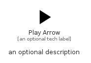

# PlayArrow


```text
material/Av/PlayArrow
```

```text
include('material/Av/PlayArrow')
```


| Illustration | PlayArrow |
| :---: | :---: |
|  |  |


## Sprites
The item provides the following sriptes:

- `<$PlayArrowXs>`
- `<$PlayArrowSm>`
- `<$PlayArrowMd>`
- `<$PlayArrowLg>`


## PlayArrow

### Load remotely
```plantuml
@startuml
' configures the library
!global $LIB_BASE_LOCATION="https://raw.githubusercontent.com/tmorin/plantuml-libs/master/distribution"

' loads the library's bootstrap
!include $LIB_BASE_LOCATION/bootstrap.puml

' loads the package bootstrap
include('material/bootstrap')

' loads the Item which embeds the element PlayArrow
include('material/Av/PlayArrow')

' renders the element
PlayArrow('PlayArrow', 'Play Arrow', 'an optional tech label', 'an optional description')
@enduml
```

### Load locally
```plantuml
@startuml
' configures the library
!global $INCLUSION_MODE="local"
!global $LIB_BASE_LOCATION="../.."

' loads the library's bootstrap
!include $LIB_BASE_LOCATION/bootstrap.puml

' loads the package bootstrap
include('material/bootstrap')

' loads the Item which embeds the element PlayArrow
include('material/Av/PlayArrow')

' renders the element
PlayArrow('PlayArrow', 'Play Arrow', 'an optional tech label', 'an optional description')
@enduml
```

