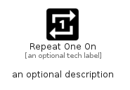

# RepeatOneOn


```text
material/Av/RepeatOneOn
```

```text
include('material/Av/RepeatOneOn')
```


| Illustration | RepeatOneOn |
| :---: | :---: |
|  |  |


## Sprites
The item provides the following sriptes:

- `<$RepeatOneOnXs>`
- `<$RepeatOneOnSm>`
- `<$RepeatOneOnMd>`
- `<$RepeatOneOnLg>`


## RepeatOneOn

### Load remotely
```plantuml
@startuml
' configures the library
!global $LIB_BASE_LOCATION="https://raw.githubusercontent.com/tmorin/plantuml-libs/master/distribution"

' loads the library's bootstrap
!include $LIB_BASE_LOCATION/bootstrap.puml

' loads the package bootstrap
include('material/bootstrap')

' loads the Item which embeds the element RepeatOneOn
include('material/Av/RepeatOneOn')

' renders the element
RepeatOneOn('RepeatOneOn', 'Repeat One On', 'an optional tech label', 'an optional description')
@enduml
```

### Load locally
```plantuml
@startuml
' configures the library
!global $INCLUSION_MODE="local"
!global $LIB_BASE_LOCATION="../.."

' loads the library's bootstrap
!include $LIB_BASE_LOCATION/bootstrap.puml

' loads the package bootstrap
include('material/bootstrap')

' loads the Item which embeds the element RepeatOneOn
include('material/Av/RepeatOneOn')

' renders the element
RepeatOneOn('RepeatOneOn', 'Repeat One On', 'an optional tech label', 'an optional description')
@enduml
```

