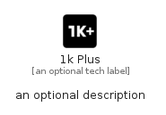

# _1KPlus


```text
material/Av/_1KPlus
```

```text
include('material/Av/_1KPlus')
```


| Illustration | _1KPlus |
| :---: | :---: |
|  |  |


## Sprites
The item provides the following sriptes:

- `<$_1KPlusXs>`
- `<$_1KPlusSm>`
- `<$_1KPlusMd>`
- `<$_1KPlusLg>`


## _1KPlus

### Load remotely
```plantuml
@startuml
' configures the library
!global $LIB_BASE_LOCATION="https://raw.githubusercontent.com/tmorin/plantuml-libs/master/distribution"

' loads the library's bootstrap
!include $LIB_BASE_LOCATION/bootstrap.puml

' loads the package bootstrap
include('material/bootstrap')

' loads the Item which embeds the element _1KPlus
include('material/Av/_1KPlus')

' renders the element
_1KPlus('1kPlus', '1k Plus', 'an optional tech label', 'an optional description')
@enduml
```

### Load locally
```plantuml
@startuml
' configures the library
!global $INCLUSION_MODE="local"
!global $LIB_BASE_LOCATION="../.."

' loads the library's bootstrap
!include $LIB_BASE_LOCATION/bootstrap.puml

' loads the package bootstrap
include('material/bootstrap')

' loads the Item which embeds the element _1KPlus
include('material/Av/_1KPlus')

' renders the element
_1KPlus('1kPlus', '1k Plus', 'an optional tech label', 'an optional description')
@enduml
```

