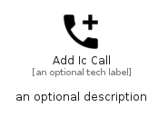

# AddIcCall


```text
material/Communication/AddIcCall
```

```text
include('material/Communication/AddIcCall')
```


| Illustration | AddIcCall |
| :---: | :---: |
|  |  |


## Sprites
The item provides the following sriptes:

- `<$AddIcCallXs>`
- `<$AddIcCallSm>`
- `<$AddIcCallMd>`
- `<$AddIcCallLg>`


## AddIcCall

### Load remotely
```plantuml
@startuml
' configures the library
!global $LIB_BASE_LOCATION="https://raw.githubusercontent.com/tmorin/plantuml-libs/master/distribution"

' loads the library's bootstrap
!include $LIB_BASE_LOCATION/bootstrap.puml

' loads the package bootstrap
include('material/bootstrap')

' loads the Item which embeds the element AddIcCall
include('material/Communication/AddIcCall')

' renders the element
AddIcCall('AddIcCall', 'Add Ic Call', 'an optional tech label', 'an optional description')
@enduml
```

### Load locally
```plantuml
@startuml
' configures the library
!global $INCLUSION_MODE="local"
!global $LIB_BASE_LOCATION="../.."

' loads the library's bootstrap
!include $LIB_BASE_LOCATION/bootstrap.puml

' loads the package bootstrap
include('material/bootstrap')

' loads the Item which embeds the element AddIcCall
include('material/Communication/AddIcCall')

' renders the element
AddIcCall('AddIcCall', 'Add Ic Call', 'an optional tech label', 'an optional description')
@enduml
```

