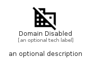

# DomainDisabled


```text
material/Communication/DomainDisabled
```

```text
include('material/Communication/DomainDisabled')
```


| Illustration | DomainDisabled |
| :---: | :---: |
|  |  |


## Sprites
The item provides the following sriptes:

- `<$DomainDisabledXs>`
- `<$DomainDisabledSm>`
- `<$DomainDisabledMd>`
- `<$DomainDisabledLg>`


## DomainDisabled

### Load remotely
```plantuml
@startuml
' configures the library
!global $LIB_BASE_LOCATION="https://raw.githubusercontent.com/tmorin/plantuml-libs/master/distribution"

' loads the library's bootstrap
!include $LIB_BASE_LOCATION/bootstrap.puml

' loads the package bootstrap
include('material/bootstrap')

' loads the Item which embeds the element DomainDisabled
include('material/Communication/DomainDisabled')

' renders the element
DomainDisabled('DomainDisabled', 'Domain Disabled', 'an optional tech label', 'an optional description')
@enduml
```

### Load locally
```plantuml
@startuml
' configures the library
!global $INCLUSION_MODE="local"
!global $LIB_BASE_LOCATION="../.."

' loads the library's bootstrap
!include $LIB_BASE_LOCATION/bootstrap.puml

' loads the package bootstrap
include('material/bootstrap')

' loads the Item which embeds the element DomainDisabled
include('material/Communication/DomainDisabled')

' renders the element
DomainDisabled('DomainDisabled', 'Domain Disabled', 'an optional tech label', 'an optional description')
@enduml
```

