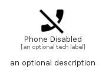

# PhoneDisabled


```text
material/Communication/PhoneDisabled
```

```text
include('material/Communication/PhoneDisabled')
```


| Illustration | PhoneDisabled |
| :---: | :---: |
|  |  |


## Sprites
The item provides the following sriptes:

- `<$PhoneDisabledXs>`
- `<$PhoneDisabledSm>`
- `<$PhoneDisabledMd>`
- `<$PhoneDisabledLg>`


## PhoneDisabled

### Load remotely
```plantuml
@startuml
' configures the library
!global $LIB_BASE_LOCATION="https://raw.githubusercontent.com/tmorin/plantuml-libs/master/distribution"

' loads the library's bootstrap
!include $LIB_BASE_LOCATION/bootstrap.puml

' loads the package bootstrap
include('material/bootstrap')

' loads the Item which embeds the element PhoneDisabled
include('material/Communication/PhoneDisabled')

' renders the element
PhoneDisabled('PhoneDisabled', 'Phone Disabled', 'an optional tech label', 'an optional description')
@enduml
```

### Load locally
```plantuml
@startuml
' configures the library
!global $INCLUSION_MODE="local"
!global $LIB_BASE_LOCATION="../.."

' loads the library's bootstrap
!include $LIB_BASE_LOCATION/bootstrap.puml

' loads the package bootstrap
include('material/bootstrap')

' loads the Item which embeds the element PhoneDisabled
include('material/Communication/PhoneDisabled')

' renders the element
PhoneDisabled('PhoneDisabled', 'Phone Disabled', 'an optional tech label', 'an optional description')
@enduml
```

