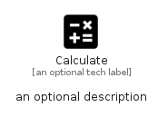

# Calculate


```text
material/Content/Calculate
```

```text
include('material/Content/Calculate')
```


| Illustration | Calculate |
| :---: | :---: |
|  |  |


## Sprites
The item provides the following sriptes:

- `<$CalculateXs>`
- `<$CalculateSm>`
- `<$CalculateMd>`
- `<$CalculateLg>`


## Calculate

### Load remotely
```plantuml
@startuml
' configures the library
!global $LIB_BASE_LOCATION="https://raw.githubusercontent.com/tmorin/plantuml-libs/master/distribution"

' loads the library's bootstrap
!include $LIB_BASE_LOCATION/bootstrap.puml

' loads the package bootstrap
include('material/bootstrap')

' loads the Item which embeds the element Calculate
include('material/Content/Calculate')

' renders the element
Calculate('Calculate', 'Calculate', 'an optional tech label', 'an optional description')
@enduml
```

### Load locally
```plantuml
@startuml
' configures the library
!global $INCLUSION_MODE="local"
!global $LIB_BASE_LOCATION="../.."

' loads the library's bootstrap
!include $LIB_BASE_LOCATION/bootstrap.puml

' loads the package bootstrap
include('material/bootstrap')

' loads the Item which embeds the element Calculate
include('material/Content/Calculate')

' renders the element
Calculate('Calculate', 'Calculate', 'an optional tech label', 'an optional description')
@enduml
```

