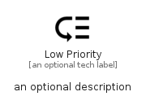

# LowPriority


```text
material/Content/LowPriority
```

```text
include('material/Content/LowPriority')
```


| Illustration | LowPriority |
| :---: | :---: |
|  |  |


## Sprites
The item provides the following sriptes:

- `<$LowPriorityXs>`
- `<$LowPrioritySm>`
- `<$LowPriorityMd>`
- `<$LowPriorityLg>`


## LowPriority

### Load remotely
```plantuml
@startuml
' configures the library
!global $LIB_BASE_LOCATION="https://raw.githubusercontent.com/tmorin/plantuml-libs/master/distribution"

' loads the library's bootstrap
!include $LIB_BASE_LOCATION/bootstrap.puml

' loads the package bootstrap
include('material/bootstrap')

' loads the Item which embeds the element LowPriority
include('material/Content/LowPriority')

' renders the element
LowPriority('LowPriority', 'Low Priority', 'an optional tech label', 'an optional description')
@enduml
```

### Load locally
```plantuml
@startuml
' configures the library
!global $INCLUSION_MODE="local"
!global $LIB_BASE_LOCATION="../.."

' loads the library's bootstrap
!include $LIB_BASE_LOCATION/bootstrap.puml

' loads the package bootstrap
include('material/bootstrap')

' loads the Item which embeds the element LowPriority
include('material/Content/LowPriority')

' renders the element
LowPriority('LowPriority', 'Low Priority', 'an optional tech label', 'an optional description')
@enduml
```

