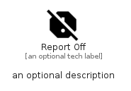

# ReportOff


```text
material/Content/ReportOff
```

```text
include('material/Content/ReportOff')
```


| Illustration | ReportOff |
| :---: | :---: |
|  |  |


## Sprites
The item provides the following sriptes:

- `<$ReportOffXs>`
- `<$ReportOffSm>`
- `<$ReportOffMd>`
- `<$ReportOffLg>`


## ReportOff

### Load remotely
```plantuml
@startuml
' configures the library
!global $LIB_BASE_LOCATION="https://raw.githubusercontent.com/tmorin/plantuml-libs/master/distribution"

' loads the library's bootstrap
!include $LIB_BASE_LOCATION/bootstrap.puml

' loads the package bootstrap
include('material/bootstrap')

' loads the Item which embeds the element ReportOff
include('material/Content/ReportOff')

' renders the element
ReportOff('ReportOff', 'Report Off', 'an optional tech label', 'an optional description')
@enduml
```

### Load locally
```plantuml
@startuml
' configures the library
!global $INCLUSION_MODE="local"
!global $LIB_BASE_LOCATION="../.."

' loads the library's bootstrap
!include $LIB_BASE_LOCATION/bootstrap.puml

' loads the package bootstrap
include('material/bootstrap')

' loads the Item which embeds the element ReportOff
include('material/Content/ReportOff')

' renders the element
ReportOff('ReportOff', 'Report Off', 'an optional tech label', 'an optional description')
@enduml
```

