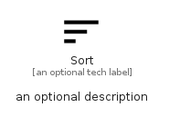

# Sort


```text
material/Content/Sort
```

```text
include('material/Content/Sort')
```


| Illustration | Sort |
| :---: | :---: |
|  |  |


## Sprites
The item provides the following sriptes:

- `<$SortXs>`
- `<$SortSm>`
- `<$SortMd>`
- `<$SortLg>`


## Sort

### Load remotely
```plantuml
@startuml
' configures the library
!global $LIB_BASE_LOCATION="https://raw.githubusercontent.com/tmorin/plantuml-libs/master/distribution"

' loads the library's bootstrap
!include $LIB_BASE_LOCATION/bootstrap.puml

' loads the package bootstrap
include('material/bootstrap')

' loads the Item which embeds the element Sort
include('material/Content/Sort')

' renders the element
Sort('Sort', 'Sort', 'an optional tech label', 'an optional description')
@enduml
```

### Load locally
```plantuml
@startuml
' configures the library
!global $INCLUSION_MODE="local"
!global $LIB_BASE_LOCATION="../.."

' loads the library's bootstrap
!include $LIB_BASE_LOCATION/bootstrap.puml

' loads the package bootstrap
include('material/bootstrap')

' loads the Item which embeds the element Sort
include('material/Content/Sort')

' renders the element
Sort('Sort', 'Sort', 'an optional tech label', 'an optional description')
@enduml
```

