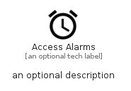

# AccessAlarms


```text
material/Device/AccessAlarms
```

```text
include('material/Device/AccessAlarms')
```


| Illustration | AccessAlarms |
| :---: | :---: |
|  |  |


## Sprites
The item provides the following sriptes:

- `<$AccessAlarmsXs>`
- `<$AccessAlarmsSm>`
- `<$AccessAlarmsMd>`
- `<$AccessAlarmsLg>`


## AccessAlarms

### Load remotely
```plantuml
@startuml
' configures the library
!global $LIB_BASE_LOCATION="https://raw.githubusercontent.com/tmorin/plantuml-libs/master/distribution"

' loads the library's bootstrap
!include $LIB_BASE_LOCATION/bootstrap.puml

' loads the package bootstrap
include('material/bootstrap')

' loads the Item which embeds the element AccessAlarms
include('material/Device/AccessAlarms')

' renders the element
AccessAlarms('AccessAlarms', 'Access Alarms', 'an optional tech label', 'an optional description')
@enduml
```

### Load locally
```plantuml
@startuml
' configures the library
!global $INCLUSION_MODE="local"
!global $LIB_BASE_LOCATION="../.."

' loads the library's bootstrap
!include $LIB_BASE_LOCATION/bootstrap.puml

' loads the package bootstrap
include('material/bootstrap')

' loads the Item which embeds the element AccessAlarms
include('material/Device/AccessAlarms')

' renders the element
AccessAlarms('AccessAlarms', 'Access Alarms', 'an optional tech label', 'an optional description')
@enduml
```

